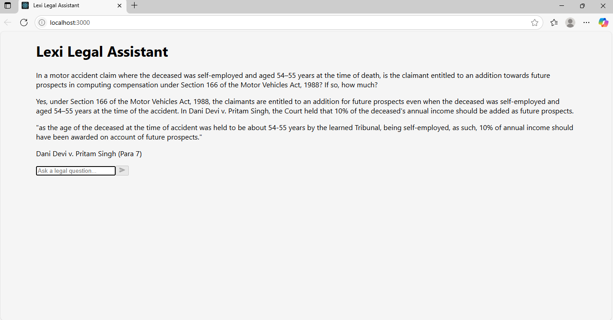
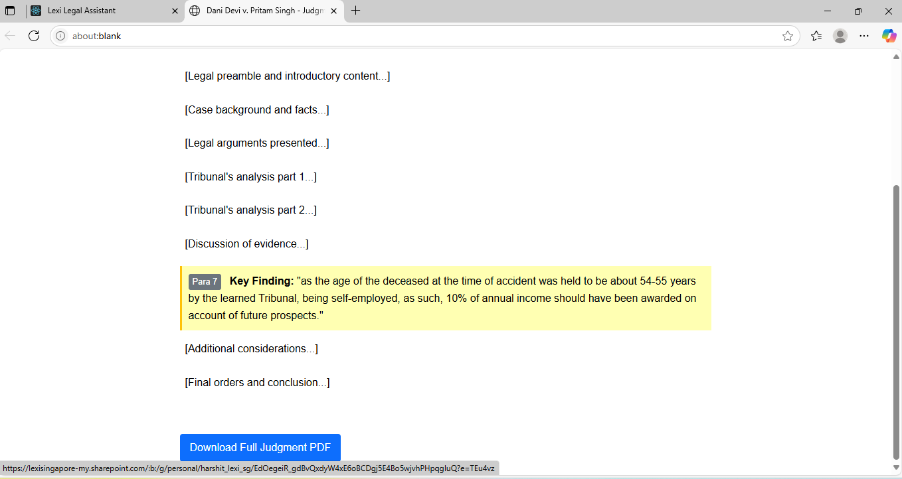

# Lexisg Frontend Intern Test – Legal Assistant Interface

A minimal frontend interface for a Lexi-style legal assistant. This React-based app simulates how Lexi helps users trace AI-generated legal answers back to real documents with clickable citations.

---

## 🎯 Objective

- Ask a legal question
- See a simulated AI-generated legal answer
- View citation(s) from real judgments
- Click the citation to open a **mock PDF viewer**
- Simulate scroll and highlight to the cited **paragraph**

---

## 💬 Simulation Example

### ▶️ Query Used:
```
"In a motor accident claim where the deceased was self-employed and aged 54–55 years at the time of death, is the claimant entitled to an addition towards future prospects in computing compensation under Section 166 of the Motor Vehicles Act, 1988? If so, how much?"
```

### ✅ Simulated Answer:
> Yes, under Section 166 of the Motor Vehicles Act, 1988, the claimants are entitled to an addition for future prospects even when the deceased was self-employed and aged 54–55 years at the time of the accident. In Dani Devi v. Pritam Singh, the Court held that 10% of the deceased’s annual income should be added as future prospects.

### 📚 Citation Text:
> “as the age of the deceased at the time of accident was held to be about 54–55 years by the learned Tribunal, being self-employed, as such, 10% of annual income should have been awarded on account of future prospects.”  
> *(Para 7 of the document)*

On click → opens simulated PDF viewer, scrolls to and highlights **Paragraph 7**

---

## ⚙️ Technologies Used

- React.js
- Tailwind CSS
- React Icons
- HTML5 + CSS3

---

## 📥 Installation & Running Locally

1. **Clone the repository**
```bash
git clone https://github.com/akshitkuma/lexisg-frontend-intern-test.git
cd lexisg-frontend-intern-test
```

2. **Install dependencies**
```bash
npm install
```

3. **Start the development server**
```bash
npm start
```

4. **Open in browser**
```
http://localhost:3000
```

---

## 📁 File Structure

```
lexisg-frontend-intern-test/
├── public/
├── src/
│   ├── components/
│   │   ├── ChatInterface.jsx      # Main chat logic
│   │   ├── Citation.jsx           # Handles clickable citation card + PDF logic
│   │   ├── Message.jsx            # Message bubble UI
│   │   └── PDFViewer.jsx          # (Optional for real PDF embed)
│   ├── App.js
│   └── index.js
├── package.json
└── README.md
```

---

## 🔗 Citation Handling

- Each answer includes a clickable citation box
- On click:
  - Opens a new tab (simulated PDF viewer)
  - Scrolls to and highlights the cited paragraph
  - Displays a mock paragraph with the citation text and **Para 7** label
  - Includes a "Download Judgment PDF" button linking to the actual PDF

🧠 *This simulates traceability from AI answer to real legal documents, just like Lexi.*

---

## 📸 Screenshot


```
📷   
*Chat Interface with Answer and Citation Display*

  
*When Click On Citation: Highlight Paragraph & Download Judgment PDF*


```

---

## 🌐 [Bonus] Hosting (Optional)

Deployed Live At:  
➡️ https://your-username.github.io/lexisg-frontend-intern-test *(replace if hosted)*

---

## 🔮 Future Ideas

- Real backend integration for live answers
- PDF.js for rendering actual PDF content
- User authentication and saved history
- Dark mode toggle
- Mobile keyboard-aware scroll fix

---
